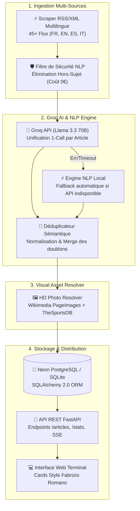

# MercatoPULSE — Plateforme d'Intelligence & Veille Mercato Football en Temps Réel

[](https://www.python.org/)
[](https://fastapi.tiangolo.com/)
[](https://neon.tech/)
[](https://groq.com/)
[](LICENSE)

**MercatoPULSE** est une application full-stack de collecte, d'analyse et de structuration en temps réel de l'actualité des transferts de football mondial. 

Le système agrège **45+ sources d'information spécialisées** (*Sky Sports, Foot Mercato, L'Équipe, Marca, BBC Sport, RMC, Fabrizio Romano feeds...*) en 4 langues (*Français, Anglais, Espagnol, Italien*), résout la déduplication sémantique des rumeurs et génère automatiquement des fiches de transfert enrichies (statut du deal, montants, blasons de clubs, portraits HD des joueurs).

---

## 🏛️ Architecture Technique & Workflow Data

L'application repose sur une architecture découplée (Clean Architecture) combinant un moteur d'ingestion de données asservi par IA et une API REST asynchrone FastAPI.



---

## ⚡ Défis Techniques & Solutions Apportées

### 1. Traitement Hybride IA / NLP Local (Haute Disponibilité)
* **Problématique** : Dépendre uniquement d'un LLM tiers expose l'application aux quotas d'API, à la latence réseau ou aux pannes de service.
* **Solution** : Implémentation d'un **Groq Brain Engine V2** hybride (`src/ai_enhancer.py`). Un prompt système structuré extrait en une seule requête JSON le joueur, les clubs, la catégorie de ligue, le statut (`OFFICIEL ✅`, `HERE WE GO 🔥`, `NÉGOCIATION 💬`, `RUMEUR 📰`) et rédige le résumé au style journalisme Fabrizio Romano. En cas d'erreur ou d'absence de clé API, le système bascule de façon transparente sur un **moteur NLP local à règles** (`src/mercato_nlp.py`) à 0 € de surcoût.

### 2. Déduplication Sémantique des Transferts Multi-Sources
* **Problématique** : Un même transfert (ex: *Ferran Torres du Barça au PSG*) est publié simultanément par 10 médias sous des titres et langues différents.
* **Solution** : Développement d'un module de hashage sémantique (`src/deduplicator.py`). Chaque article se voit attribuer une clé normalisée `joueur__club_vendeur__club_acheteur`. Lors de l'ingestion, les articles partageant le même hash sont fusionnés en conservant le score de crédibilité le plus élevé et l'image la plus complète.

### 3. Résolution Dynamique des Visuels Joueurs & Blasons
* **Problématique** : Les flux d'actualités (notamment Google News RSS) ne fournissent pas toujours les images des joueurs en haute définition.
* **Solution** : Module d'enrichissement multi-niveaux (`src/photo_enricher.py`) interrogeant les API de Wikipedia PageImages et TheSportsDB. Si aucun portrait officiel n'est trouvé, le frontend bascule automatiquement sur un rendu graphique stylisé (carte d'annonce de transfert avec filigrane et logos de clubs).

### 4. Robustesse DB & Auto-Migrations
* **Problématique** : Supporter à la fois un environnement de développement local (SQLite) et un environnement de production hébergé (Neon PostgreSQL).
* **Solution** : Gestion des sessions via SQLAlchemy 2.0 avec scripts d'auto-migration DDL idempotents (`ALTER TABLE ... ADD COLUMN IF NOT EXISTS`) exécutés lors du cycle de vie FastAPI (`lifespan`), évitant l'échec de démarrage lors des montées de version.

---

## 🛠️ Stack Technologique

- **Backend** : Python 3.10+, FastAPI, Pydantic v2, Uvicorn, APScheduler
- **Base de données** : PostgreSQL (Neon DB), SQLite, SQLAlchemy 2.0
- **Intelligence Artificielle & NLP** : Groq API (`llama-3.3-70b-versatile`), Regex / Rules Engine local, BeautifulSoup4, lxml
- **Frontend** : HTML5, CSS Vanilla (Design Dark Mode / Glassmorphism), JavaScript ES6+
- **CI/CD & Hosting** : Render (API Service), GitHub

---

## 📁 Structure du Dépôt

```text
isic-main/
├── backend/                  # Architecture API REST Clean
│   ├── main.py               # Point d'entrée FastAPI & gestion du lifespan
│   ├── core/                 # Configuration centralisée (Pydantic Settings)
│   ├── db/                   # Connexion ORM, sessions & auto-migrations
│   ├── models/               # Modèles de tables SQLAlchemy (Article, Source)
│   ├── schemas/              # Schémas de validation Pydantic (ArticleItem, Response)
│   ├── repositories/         # Couche d'accès aux données (Pattern Repository)
│   ├── routers/              # Endpoints API (/articles, /system)
│   └── services/             # Logique métier & services d'ingestion
├── src/                      # Moteur Data Scraping & Pipeline IA
│   ├── ai_enhancer.py        # Groq Brain Engine (Analyse LLM + Fallback NLP)
│   ├── ai_organizer.py       # Orchestrateur du pipeline & classification
│   ├── deduplicator.py       # Algorithme de déduplication sémantique
│   ├── photo_enricher.py     # Résoluteur de portraits HD & badges de clubs
│   ├── mercato_nlp.py        # Moteur d'extraction NLP local & dictionnaires
│   ├── scraper.py            # Collecteur multi-sources (45+ flux RSS/XML)
│   └── scheduler.py          # Planificateur de tâches d'arrière-plan
├── web/                      # Frontend Web
│   └── index.html            # Dashboard UI Terminal Mercato
├── requirements.txt          # Dépendances du projet
└── README.md
```

---

## 🚀 Installation & Déploiement Local

### Prerequisites
- Python 3.10+
- Git

### 1. Cloner le dépôt et configurer l'environnement
```bash
git clone https://github.com/AymanTN1/sports-scraping.git
cd sports-scraping

# Créer un environnement virtuel
python -m venv .venv

# Activer l'environnement
# Windows :
.venv\Scripts\activate
# Linux/macOS :
# source .venv/bin/activate

# Installer les dépendances
pip install -r requirements.txt
```

### 2. Variables d'environnement (Optionnel)
Créer un fichier `.env` à la racine si vous souhaitez activer l'enrichissement par l'API Groq :
```env
GROQ_API_KEY=gsk_votre_cle_api_groq
DATABASE_URL=sqlite:///./data/sportpulse.db
SCRAPE_INTERVAL_MINUTES=15
```
*(Remarque : Si aucune clé Groq n'est fournie, le système basculera automatiquement sur le moteur NLP local sans erreur).*

### 3. Lancer l'application
```bash
# Exécution du serveur de développement FastAPI
uvicorn backend.main:app --reload --port 8000
```

Accéder aux services :
- 🖥️ **Interface Web Terminal** : `http://127.0.0.1:8000/`
- 📖 **Documentation Interactive Swagger** : `http://127.0.0.1:8000/api/docs`
- 📋 **ReDoc** : `http://127.0.0.1:8000/redoc`

---

## 🔌 Référence des Endpoints REST

| Méthode | Endpoint | Description |
|---|---|---|
| `GET` | `/api/v1/articles` | Récupère la liste paginée des articles (filtres par ligue, club, statut, recherche) |
| `GET` | `/api/v1/articles/{id}` | Détail d'un article spécifique |
| `GET` | `/api/v1/articles/leagues` | Liste des ligues et championnats représentés |
| `GET` | `/api/v1/articles/clubs` | Liste de tous les clubs identifiés |
| `POST` | `/api/v1/articles/import-csv` | Déclenche l'ingestion des articles analysés |
| `POST` | `/api/v1/articles/trigger-pipeline` | Déclenche l'exécution instantanée du pipeline de scraping |
| `GET` | `/api/v1/system/health` | Vérification de l'état du service |
| `GET` | `/api/v1/system/stats` | Statistiques globales sur les données de transfert |

---

## 📄 Licence
Ce projet est sous licence **MIT**.
