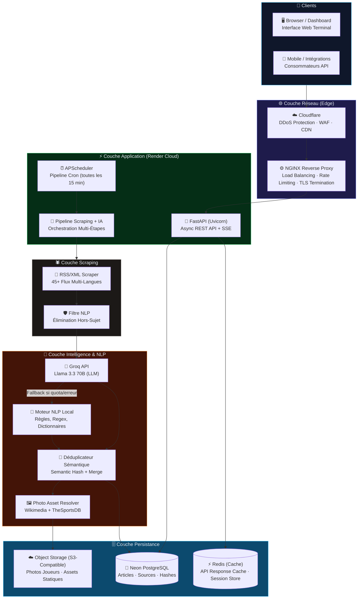
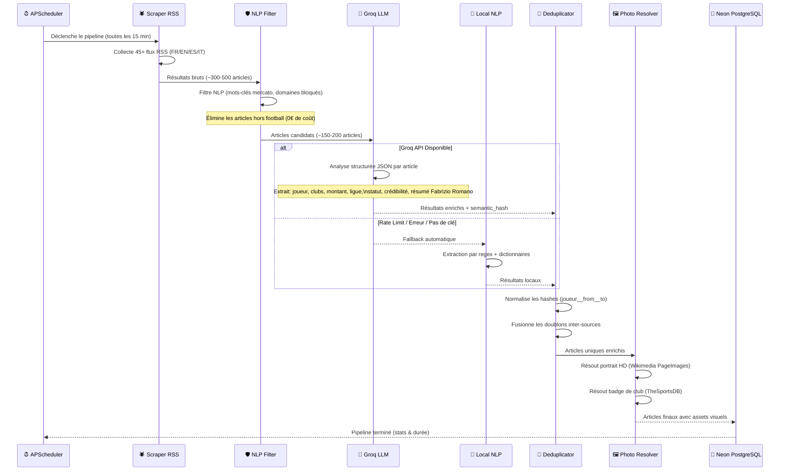
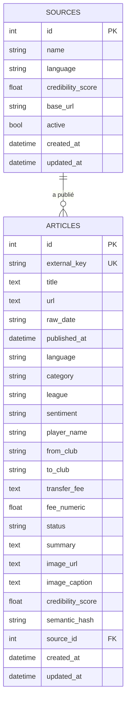
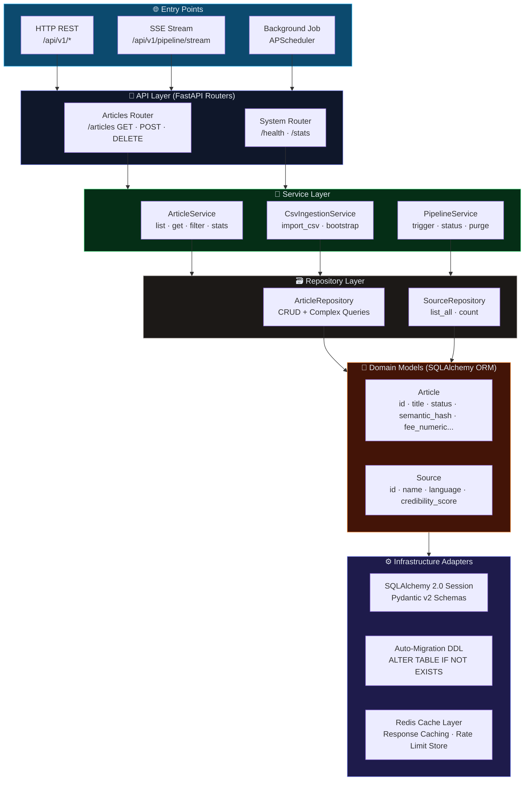
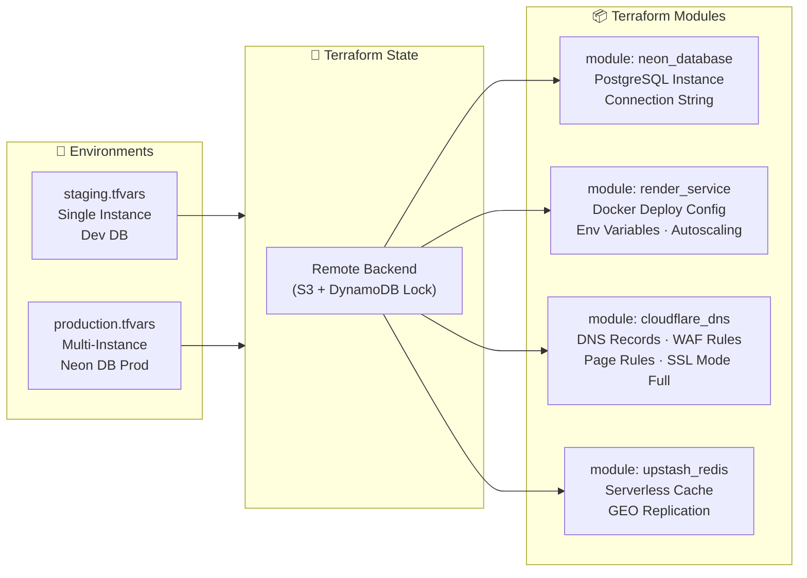
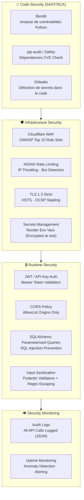
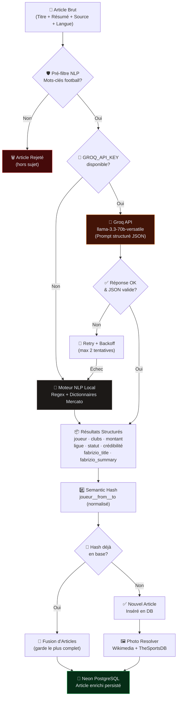
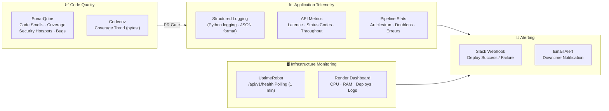

# MercatoPULSE — Real-Time Football Transfer Intelligence Platform

<p align="center">
  
  
  
  
  
  
  
  
</p>

<p align="center">
  <b>Collecte · Analyse · Déduplication · Distribution — 45+ sources football mondiales en temps réel</b>
</p>

---

## 📌 Vue d'Ensemble

**MercatoPULSE** est une plateforme full-stack de surveillance et d'intelligence mercato football. Le système agrège **45+ sources spécialisées** (*Sky Sports, L'Équipe, Marca, BBC Sport, Foot Mercato, Fabrizio Romano feeds...*) en **4 langues** (FR, EN, ES, IT), déduplique sémantiquement les rumeurs redondantes grâce à un pipeline IA, et distribue les données enrichies via une API REST haute-performance et un dashboard web interactif.

---

## 1️⃣ Architecture Globale du Système



---

## 2️⃣ Pipeline de Données IA — Flux Détaillé



---

## 3️⃣ Architecture Base de Données (ERD)



---

## 4️⃣ CI/CD Pipeline & DevSecOps

```mermaid
flowchart LR
    subgraph DEV["💻 Developer Workflow"]
        CODE["Code Push\n(Git Branch)"]
        PR["Pull Request\n(Code Review)"]
    end

    subgraph SAST["🔐 Static Analysis (DevSecOps)"]
        BANDIT["🐍 Bandit\nSecurity SAST (Python)"]
        SECRETS["🔑 Gitleaks\nSecret Detection"]
        SQ["📊 SonarQube\nCode Quality Gate\nCoverage · Duplications · Bugs"]
    end

    subgraph TESTS["🧪 Test Suite"]
        UNIT["✅ pytest Unit Tests\nModels · Services · NLP Engine"]
        INT["🔗 pytest Integration Tests\nAPI Endpoints · DB Queries"]
        COV["📈 Coverage Report\n(Codecov)"]
    end

    subgraph BUILD["📦 Build & Package"]
        DOCKER_BUILD["🐳 Docker Build\nMulti-stage Dockerfile"]
        DOCKER_PUSH["📤 Docker Push\nGHCR / Docker Hub"]
    end

    subgraph IaC["🏗️ Infrastructure as Code"]
        TERRAFORM["🟣 Terraform\nProvision Neon DB · Render Service\n· Cloudflare DNS · Redis"]
        PLAN["📋 terraform plan\n(PR Preview)"]
        APPLY["⚙️ terraform apply\n(CD Merge)"]
        TERRAFORM --> PLAN --> APPLY
    end

    subgraph DEPLOY["🚀 Deployment (Render)"]
        STAGING["🟡 Staging Environment\nPreview Deploy"]
        PROD["🟢 Production Environment\nmercatopulse-api.onrender.com"]
        SMOKE["🔍 Smoke Tests\n/api/v1/health Check"]
        STAGING --> SMOKE --> PROD
    end

    subgraph MONITOR["📡 Monitoring & Observability"]
        LOGS["📋 Structured Logging\n(JSON + Render Logs)"]
        METRICS["📊 Metrics & Uptime\n(UptimeRobot / Grafana)"]
        ALERTS["🚨 Alerting\n(PagerDuty / Slack Webhook)"]
        LOGS --> METRICS --> ALERTS
    end

    CODE --> PR
    PR --> SECRETS
    PR --> BANDIT
    PR --> SQ
    SECRETS & BANDIT & SQ --> UNIT
    UNIT --> INT --> COV
    COV --> DOCKER_BUILD --> DOCKER_PUSH
    DOCKER_PUSH --> STAGING
    DOCKER_PUSH --> APPLY
    PROD --> MONITOR

    style DEV fill:#0f172a,stroke:#38bdf8,color:#e2e8f0
    style SAST fill:#450a0a,stroke:#f87171,color:#e2e8f0
    style TESTS fill:#052e16,stroke:#4ade80,color:#e2e8f0
    style BUILD fill:#1e3a5f,stroke:#60a5fa,color:#e2e8f0
    style IaC fill:#3b0764,stroke:#a78bfa,color:#e2e8f0
    style DEPLOY fill:#14532d,stroke:#86efac,color:#e2e8f0
    style MONITOR fill:#451a03,stroke:#fbbf24,color:#e2e8f0
```



---

## 5️⃣ Architecture Microservices & Backend (Clean Architecture)



---

## 6️⃣ Infrastructure as Code — Terraform



---

## 7️⃣ Sécurité & Conformité (DevSecOps)



---

## 8️⃣ Groq AI Brain Engine — Décision Logic



---

## 9️⃣ Monitoring & Observabilité



---

## 🛠️ Stack Technologique Complète

| Couche | Technologie | Rôle |
|---|---|---|
| **Language** | Python 3.10+ | Runtime principal |
| **API Framework** | FastAPI + Uvicorn | REST API async, SSE, OpenAPI |
| **Data Validation** | Pydantic v2 | Schémas + validation runtime |
| **ORM** | SQLAlchemy 2.0 | Abstraction DB, sessions, migrations |
| **Base de Données** | Neon PostgreSQL (Cloud) / SQLite | Persistance des données |
| **Cache** | Redis (Upstash Serverless) | Cache API, rate limiting |
| **AI / LLM** | Groq API (`llama-3.3-70b`) | Analyse, extraction, rédaction |
| **NLP Local** | Regex + Dictionnaires | Fallback sans coût |
| **Scraping** | Requests + LXML + BeautifulSoup4 | Collecte RSS/XML |
| **Planification** | APScheduler | Pipeline automatique (cron) |
| **Frontend** | HTML5 + CSS Vanilla + JS ES6+ | Dashboard Terminal Web |
| **Reverse Proxy** | NGINX | Load balancing, TLS, rate limiting |
| **CDN / WAF** | Cloudflare | DDoS, cache edge, WAF |
| **Conteneurisation** | Docker + Docker Compose | Build reproductible, multi-stage |
| **IaC** | Terraform | Provisioning Cloud déclaratif |
| **CI/CD** | GitHub Actions | Build, test, deploy automatisé |
| **GitOps / CD** | Argo CD | Déploiement déclaratif Kubernetes |
| **Code Quality** | SonarQube | Quality Gate + Hotspots |
| **Security SAST** | Bandit + Gitleaks | Vulnérabilités & secrets |
| **Tests** | pytest + pytest-cov | Tests unitaires & intégration |
| **Hosting** | Render Cloud | Déploiement API production |
| **Secrets** | Render Env Vars / Vault | Gestion sécurisée des clés |
| **Monitoring** | UptimeRobot + Render Logs | Disponibilité & alerting |

---

## 🚀 Installation & Démarrage Local

```bash
# 1. Cloner le dépôt
git clone https://github.com/AymanTN1/sports-scraping.git
cd sports-scraping

# 2. Environnement virtuel
python -m venv .venv
# Windows : .venv\Scripts\activate
# Linux/macOS : source .venv/bin/activate

# 3. Dépendances
pip install -r requirements.txt

# 4. Variables d'environnement (optionnel)
cp .env.example .env  # Configurer GROQ_API_KEY, DATABASE_URL

# 5. Démarrage
uvicorn backend.main:app --reload --port 8000
```

| Interface | URL |
|---|---|
| 🖥️ Dashboard Web | `http://127.0.0.1:8000/` |
| 📖 Swagger UI | `http://127.0.0.1:8000/api/docs` |
| 🔌 Live API (Prod) | [https://mercatopulse-api.onrender.com](https://mercatopulse-api.onrender.com) |

---

## 🔌 Endpoints REST API

| Méthode | Endpoint | Description |
|---|---|---|
| `GET` | `/api/v1/articles` | Articles paginés (filtres : ligue, club, statut, recherche) |
| `GET` | `/api/v1/articles/{id}` | Détail d'un article |
| `GET` | `/api/v1/articles/leagues` | Championnats représentés |
| `GET` | `/api/v1/articles/clubs` | Clubs identifiés |
| `GET` | `/api/v1/articles/stats` | Statistiques globales |
| `POST` | `/api/v1/articles/import-csv` | Ingestion des données analysées |
| `POST` | `/api/v1/articles/trigger-pipeline` | Déclenche le scraping immédiat |
| `POST` | `/api/v1/articles/purge-non-football` | Purge des articles hors-sujet |
| `GET` | `/api/v1/health` | Health check système |

---

## 📄 Licence

Distribué sous licence **MIT**. Voir [LICENSE](LICENSE) pour plus d'informations.
