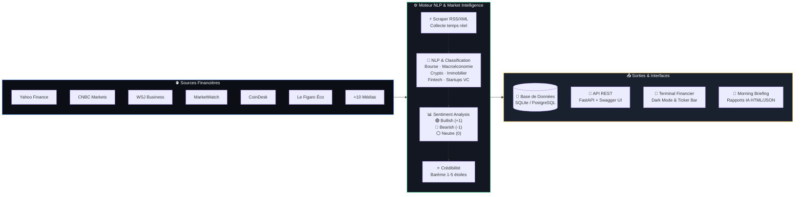

<p align="center">
  
  
  
  
  
</p>

# 📈 MarketPulse — Plateforme d'Intelligence Financière & Boursière

**MarketPulse** est une plateforme avancée de **veille financière, boursière et économique** en temps réel. Elle collecte, classifie et analyse le **sentiment des marchés (Bullish / Bearish / Neutre)** depuis **15+ médias financiers internationaux de référence** en 3 langues (*Arabe, Français, Anglais*).

> 🎯 *Transforme le bruit médiatique financier en intelligence décisionnelle et signaux de marché exploitables.*

---

## 🏗️ Architecture de la Plateforme



---

## ✨ Fonctionnalités Majeures

| Module | Description | Status |
|--------|-------------|--------|
| 🌐 **Agrégation Multi-Sources** | Extraction en temps réel de 15+ médias financiers (*Yahoo Finance, CNBC, MarketWatch, WSJ, Seeking Alpha, CoinDesk, CoinTelegraph, Le Monde Économie, Le Figaro Économie, Hespress Économie...*) | ✅ |
| 🧠 **Classification Sectorielle NLP** | Catégorisation automatique : *Bourse & Actions, Macroéconomie, Cryptomonnaies, Immobilier, Banque & Fintech, Startups & VC* | ✅ |
| 📊 **Analyse de Sentiment Financier** | Détection automatique des tendances de marché (**🟢 Bullish**, **🔴 Bearish**, **⚪ Neutre**) | ✅ |
| ⭐ **Indice de Crédibilité** | Évaluation algorithmique des sources (1 à 5 étoiles) selon la réputation éditoriale | ✅ |
| 📱 **Terminal Financier Dashboard** | Interface réactive Dark Mode style Bloomberg/TradingView avec Ticker temps réel et filtres avancés | ✅ |
| 🔌 **API REST High Performance** | API FastAPI documentée avec Swagger UI et ReDoc | ✅ |
| 📰 **Morning Briefing IA** | Synthèse quotidienne automatique d'actualités économiques | ✅ |

---

## 📁 Structure du Projet

```
marketpulse/
├── backend/                          # Backend FastAPI & Architecture Clean
│   ├── main.py                       # Application principale FastAPI
│   ├── core/                         # Configuration centralisée
│   ├── db/                           # Modèles SQLAlchemy & Connexion DB
│   ├── models/                       # Schémas de base de données (Article, Source, Sentiment)
│   ├── schemas/                      # Schémas Pydantic pour validation API
│   ├── repositories/                 # Abstraction de la couche de données
│   ├── routers/                      # Endpoints REST API (/articles, /system)
│   └── services/                     # Logique métier & Ingestion CSV/RSS
├── src/                              # Moteur Data & NLP Engine
│   ├── scraper.py                    # Collecteur multi-sources financières (RSS + LXML)
│   ├── ai_organizer.py               # Classification NLP & Sentiment Analysis (Bullish/Bearish)
│   ├── source_verifier.py            # Calculateur de crédibilité des sources financières
│   ├── report_generator.py           # Générateur de revues de presse & Morning Briefing
│   └── run_pipeline.py               # Runner du pipeline complet
├── web/                              # Terminal Financier (Frontend)
│   └── index.html                    # Interface Web moderne
├── data/                             # Base de données persistée (sportpulse.db / marketpulse.db)
│   ├── input/                        # Fichiers de configuration
│   └── output/                       # CSV d'articles vérifiés et analysés
├── test.py                           # Suite de tests d'intégration
├── verify_migration.py               # Script de validation d'architecture
├── start.py                          # Script de démarrage en une ligne
└── README.md
```

---

## 🛠️ Installation

```bash
# 1. Cloner le dépôt
git clone https://github.com/AymanTN1/marketpulse-financial-intelligence.git
cd marketpulse-financial-intelligence

# 2. Créer l'environnement virtuel
python -m venv .venv
.venv\Scripts\Activate        # Windows
# source .venv/bin/activate   # Linux/Mac

# 3. Installer les dépendances
pip install -r requirements.txt
```

---

## 🚀 Démarrage Rapide

```bash
# Lancer le serveur d'application MarketPulse
python start.py
```

Accès aux interfaces :
- 🖥️ **Terminal Financier** : http://127.0.0.1:8000/
- 📖 **Documentation API (Swagger)** : http://127.0.0.1:8000/api/docs
- 📋 **ReDoc** : http://127.0.0.1:8000/redoc

### Exécuter le scraping et l'analyse de sentiment manuellement

```bash
# Exécution du scraping massif + Classification NLP + Sentiment Analysis
python src/run_pipeline.py
```

---

## 🔌 Documentation API REST

| Méthode | Endpoint | Description |
|---------|----------|-------------|
| `GET` | `/api/v1/articles` | Liste les actualités financières (filtres par secteur, sentiment, source) |
| `POST` | `/api/v1/scrape/run` | Déclenche le scraping multi-sources en arrière-plan |
| `GET` | `/api/v1/scrape/status` | Statut en temps réel du pipeline de scraping |
| `GET` | `/api/v1/scrape/stream` | Flux SSE temps réel de progression du scraping |
| `GET` | `/api/v1/reports` | Liste des briefings financiers |
| `POST` | `/api/v1/reports/generate` | Génère un nouveau Morning Briefing financier |
| `GET` | `/api/v1/system/health` | Health Check système |
| `GET` | `/api/v1/system/stats` | Statistiques globales (Secteurs, Sentiments, Crédibilité) |

---

<p align="center">
  <b>Développé pour la veille financière et l'analyse de marché haute performance.</b>
</p>
